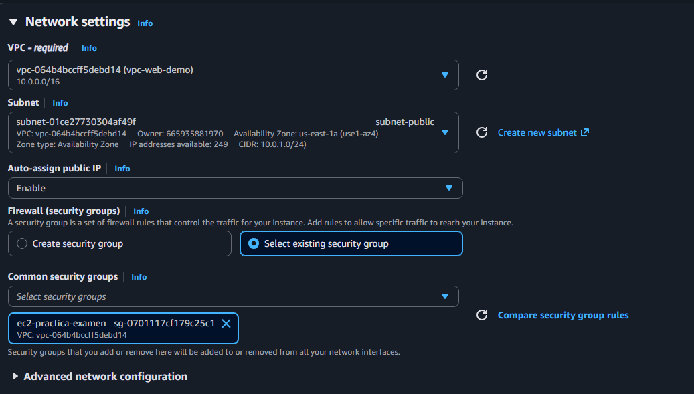

PAso a paso para desplegar todo

EFS 

Crear EFS

Copiar el ID (entre parentesis) ej: fs-0dfa62dcfe8a06be7

Crear Grupo de seguridad

Primero creamos el Grupo de seguridad de EC2:

Inbound rules: 

add rule, type
ssh  My Ip
http anywhere ipv4
https anywhere ipv4
nfs  (no pongas nada)

Ahora creamos el de ef2:

Inbound rules:

type: NFS     
source: custom
Elegimos el grupo de seguridad de la EC2 

Crear instancia

Ubuntu

crear un Par Key nuevo.

luego en network setting le damos a editar y le vamos dando nnuestros valores
Seleccionamos la VPC demo
Seleccionamos subred publica
seleccionamos select exciting groups
Seleccionamos el de la practica de examen

En advance settings.
En userdata colocamos el siguiente codigo y cambiamos el id:

#!/bin/bash
set -e

# Actualizar sistema
dnf update -y

# Docker
dnf install -y docker
systemctl start docker
systemctl enable docker

# Docker Compose
curl -L https://github.com/docker/compose/releases/download/v2.27.0/docker-compose-linux-x86_64 \
  -o /usr/local/bin/docker-compose
chmod +x /usr/local/bin/docker-compose

# Permisos
usermod -aG docker ec2-user

# EFS
dnf install -y amazon-efs-utils

mkdir -p /efs
mount -t efs fs-0dfa62dcfe8a06be7:/ /efs

echo "fs-0dfa62dcfe8a06be7:/ /efs efs _netdev,tls 0 0" >> /etc/fstab

# Carpetas del proyecto
mkdir -p /home/ec2-user/app
chown -R ec2-user:ec2-user /home/ec2-user /efs

